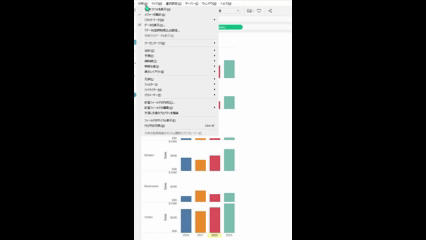
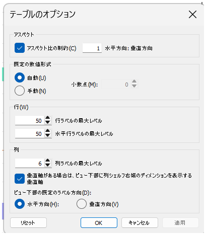
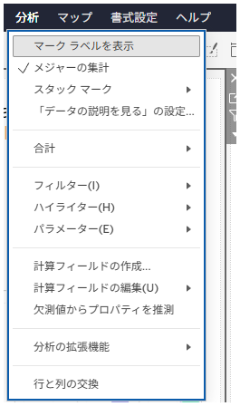

## 機能の違い
空の行・列の表示とより多くのデザインオプションのための分析タブのテーブルレイアウト機能は、Tableau Desktopでのみ利用可能です。

- **Desktop**: 分析タブからテーブルレイアウトにアクセスでき、空の行・列の表示設定、セルサイズの調整、罫線の設定など詳細なデザインオプションが利用できます。
- **Cloud**: 分析タブには基本的なオプションのみが表示され、テーブルレイアウトの詳細設定機能は利用できません。

## 使用方法
### Tableau Desktopの場合
1. ワークシートでテーブルビューを作成します。
2. 分析タブを開きます。
3. 「テーブルのオプション」を選択します。
4. テーブルレイアウト設定ダイアログが開き、以下の設定が可能です：
   - アスペクト比の調整
   - 空の行・列の表示設定
   - セルサイズの詳細調整
   - 罫線の表示設定

Desktop例:

### Tableau Cloudの場合
1. ワークシートでテーブルビューを作成します。
2. 分析タブを開きます。
3. 基本的な分析オプションのみが表示され、テーブルレイアウトの詳細設定は利用できません。

Cloud例:

## 利用例・使用場面
- **空の行・列の表示**: データに欠損がある場合でも、完全なテーブル構造を表示したい場合
- **セルサイズの調整**: レポート用に最適なテーブルサイズに調整したい場合  
- **罫線の設定**: プレゼンテーション用により見やすいテーブルフォーマットを作成したい場合
- **アスペクト比の調整**: 印刷やエクスポート時に最適な表示比率を設定したい場合

## 注意点・考慮事項
- Desktopではテーブルの外観を細かく制御でき、空のセルの表示や非表示を選択できます
- テーブルレイアウト設定は、特にクロス集計表やピボットテーブルの表示において重要な機能です
- Cloudでは基本的な分析機能のみが提供されており、テーブルの詳細なレイアウト調整は制限されています
- この機能は業務上重要（operationally-critical）とラベル付けされており、レポート作成において重要な役割を果たします

---
参考: [GitHub Issue #21](https://github.com/mickitty0511/tableau-feature-parity/issues/21)