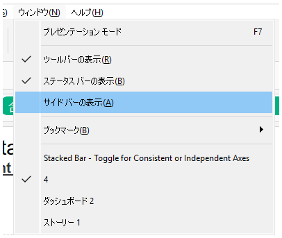

## 機能差異
ツールバー/ステータスバー表示の切り替え機能は、Tableau Desktopでのみ利用可能です。

- **Desktop**: ウィンドウメニューからツールバーとステータスバーの表示/非表示を切り替えることができます。
- **Cloud**: この機能は利用できません。

## 使用方法
### Tableau Desktopの場合
1. メニューバーの「ウィンドウ」タブをクリックします。
2. 表示オプションからツールバーやステータスバーの表示/非表示を選択できます。

### Tableau Cloudの場合
この機能はTableau Cloudでは利用できません。

## 使用例・用途
- 画面領域を最大化したい場合にツールバーを非表示にする
- ワークスペースをカスタマイズして作業効率を向上させる
- プレゼンテーション時に不要な要素を隠す

## 注意事項・制限
- この機能はTableau Desktopでのみ利用可能です
- Tableau Cloudでは画面表示のカスタマイズオプションが制限されています
- ツールバーを非表示にした場合、一部の機能へのアクセスが制限される可能性があります

---
参考: [GitHub Issue #66](https://github.com/mickitty0511/tableau-feature-parity/issues/66)