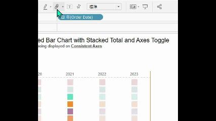

## 機能の違い
更新、グループメンバー、プレゼンテーション、動的軸、ワークブック共有などのツールバーオプションは、Tableau Desktopでのみ利用可能です。

- **Desktop**: 更新、グループメンバー、プレゼンテーション、動的軸、ワークブック共有などの拡張されたツールバーオプションが利用可能
- **Cloud**: 基本的なツールバーオプションのみ利用可能（これらの高度な機能は含まれない）

## 使用方法
### Tableau Desktop
1. Tableau Desktopを開きます
2. ワークブックを作成または開きます
3. ツールバーで以下のオプションを利用できます：
   - **更新**: データの最新状態への更新
   - **グループメンバー**: 選択した項目のグループ化
   - **プレゼンテーション**: プレゼンテーションモードの開始
   - **動的軸**: 軸の動的調整機能
   - **ワークブック共有**: ワークブックの共有オプション

### Tableau Cloud
1. Tableau Cloudにアクセスします
2. ワークブックを開きます
3. 基本的なツールバーオプションのみ利用可能です

## 利用例・用途
- **データ更新**: 最新のデータでビジュアライゼーションを更新
- **グループ化**: 関連するデータ項目をグループ化して分析を簡素化
- **プレゼンテーション**: 会議やプレゼンテーション用の全画面表示
- **動的軸**: データの変化に応じた軸の自動調整
- **共有**: チームメンバーとのワークブック共有

## 注意事項・制限
- これらの高度なツールバー機能はTableau Desktopでのみ利用可能です
- Tableau Cloudでは基本的なツールバー機能に制限されています
- より詳細な機能説明については、Tableauの公式ドキュメントを参照してください
- 今後のアップデートでTableau Cloudでも一部機能が利用可能になる可能性があります

---
参考: [GitHub Issue #51](https://github.com/mickitty0511/tableau-feature-parity/issues/51)