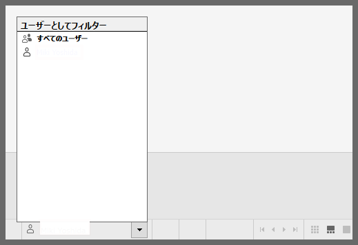

## 機能の違い
データ可視性の違いを確認するためのユーザー切り替えオプションは、Tableau Desktopでのみ利用可能です。

- **Desktop**: ユーザーを切り替えて、異なるユーザー権限でのデータ可視性の違いを確認できます。
- **Cloud**: この機能は利用できません。

## 使用方法
### Tableau Desktop
1. ワークブックを開きます。
2. データソースでRow Level Security（行レベルセキュリティ）やその他のデータ可視性制限が設定されている場合、ユーザー切り替えオプションを使用できます。
3. 異なるユーザー権限でデータがどのように表示されるかを確認します。

### Tableau Cloud
この機能はTableau Cloudでは利用できません。

## 使用例・用途
- **データセキュリティの検証**: 行レベルセキュリティが正しく機能しているかを確認
- **権限設定のテスト**: 異なるユーザーグループに対するデータアクセス制限の動作確認
- **ワークブック公開前の検証**: 公開前に意図したデータ可視性制限が適用されているかを確認

## 注意事項・考慮点
- この機能はTableau Desktopでのみ利用可能で、Tableau Cloudでは現在サポートされていません。
- データセキュリティやプライバシー要件が厳しい環境では、この機能を使用してワークブック公開前の十分な検証が重要です。
- Row Level Securityやその他のデータアクセス制限が設定されている場合にのみ有効です。

---
参照: [GitHub Issue #19](https://github.com/mickitty0511/tableau-feature-parity/issues/19)